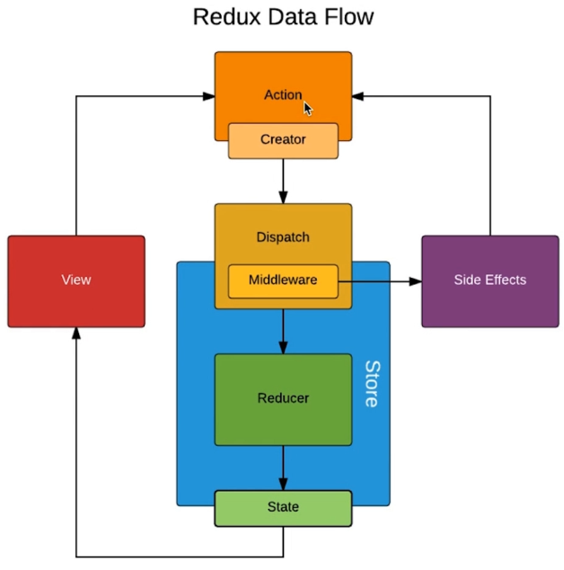

redux 工作流程

Store -> React Component (Action creators) dispatch -> (previousState, action) Reducers (newState) -> Store -> React Component

中间件 指的是 action 和 store 之间

---

三大原则：

* store是唯一的
* 只有store能改变自己的内容
* Reducer必须是纯函数

核心api

createStore
store.dispatch()
store.getState()
store.subscribe()

---

### redux-thunk

store.js

```js
import {
  compose,
  createStore,
  applyMiddleware
} from 'redux'
import thunk from 'redux-thunk'
import reducer from './reducers'

const composeEnhancers = window.__REDUX_DEVTOOLS_EXTENSION_COMPOSE__
  ? window.__REDUX_DEVTOOLS_EXTENSION_COMPOSE__({})
  : compose

const enhancer = composeEnhancers(applyMiddleware(thunk))

const store = createStore(
  reducer,
  enhancer
)

export default store
```



把异步操作放到action里

---

### redux-saga

把异步操作单独拆到一个文件里管理
